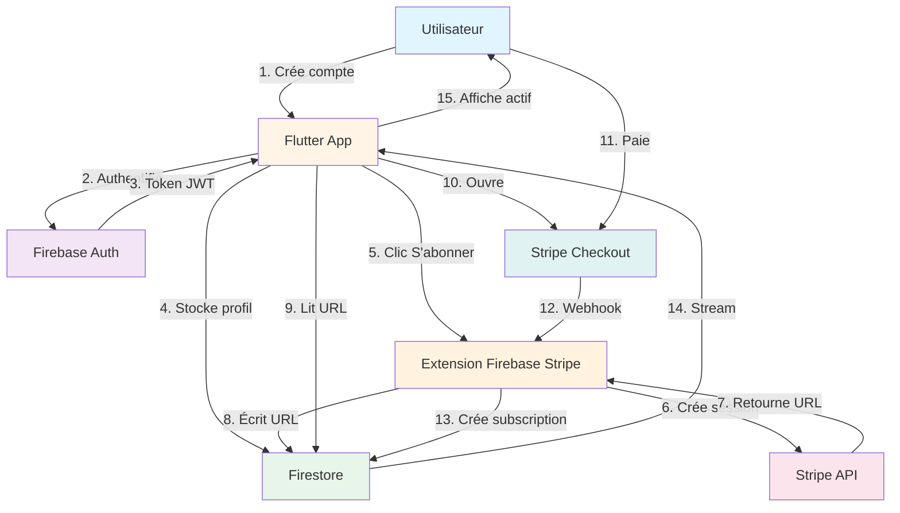
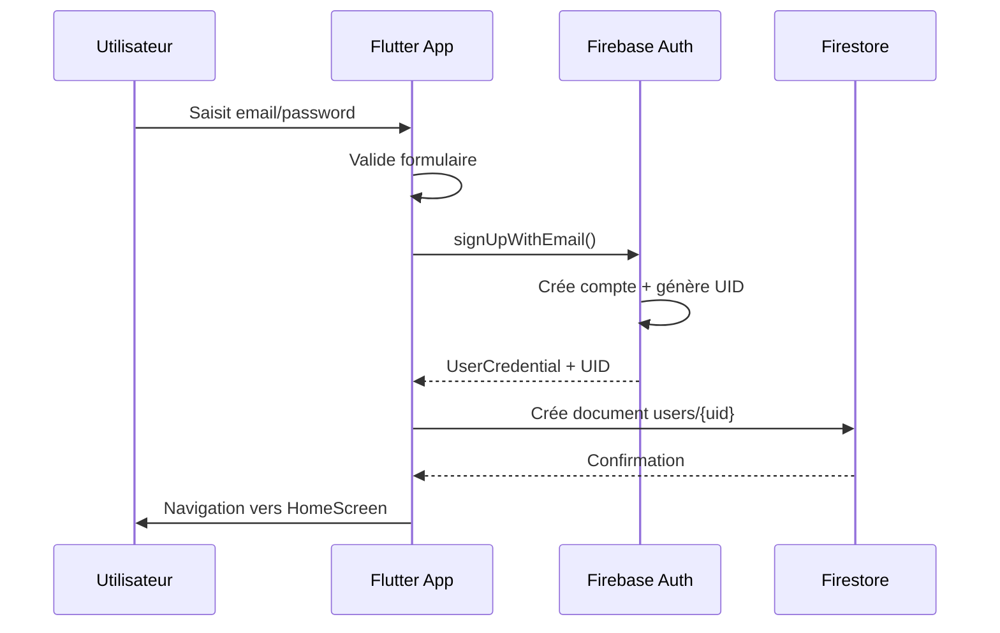
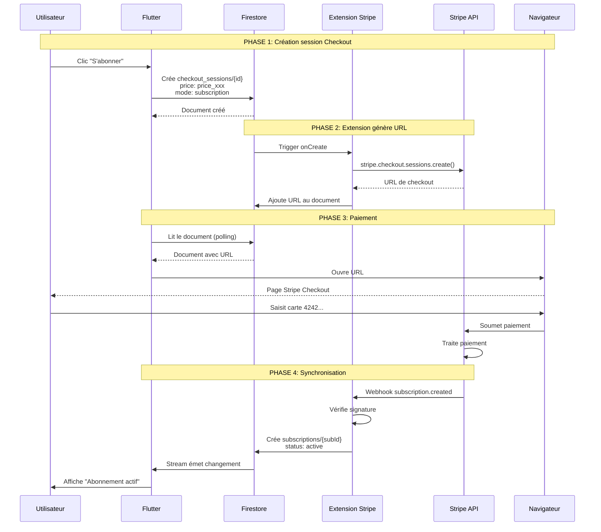
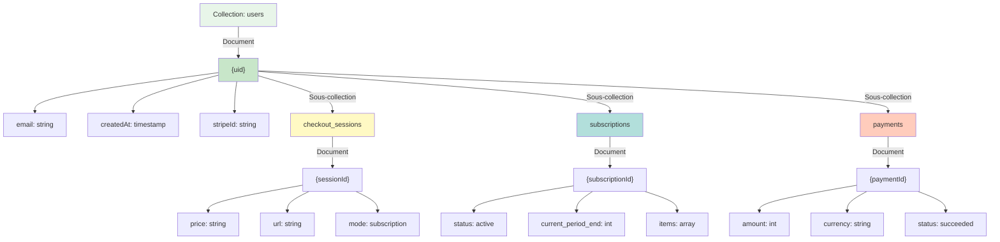
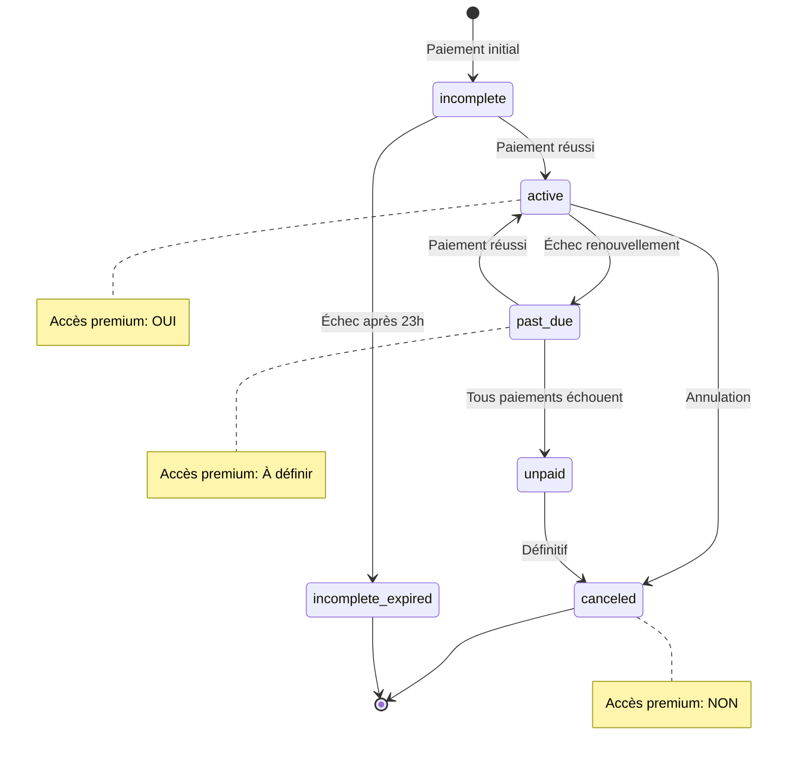
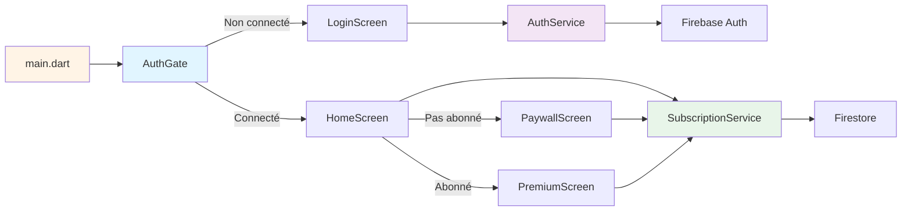
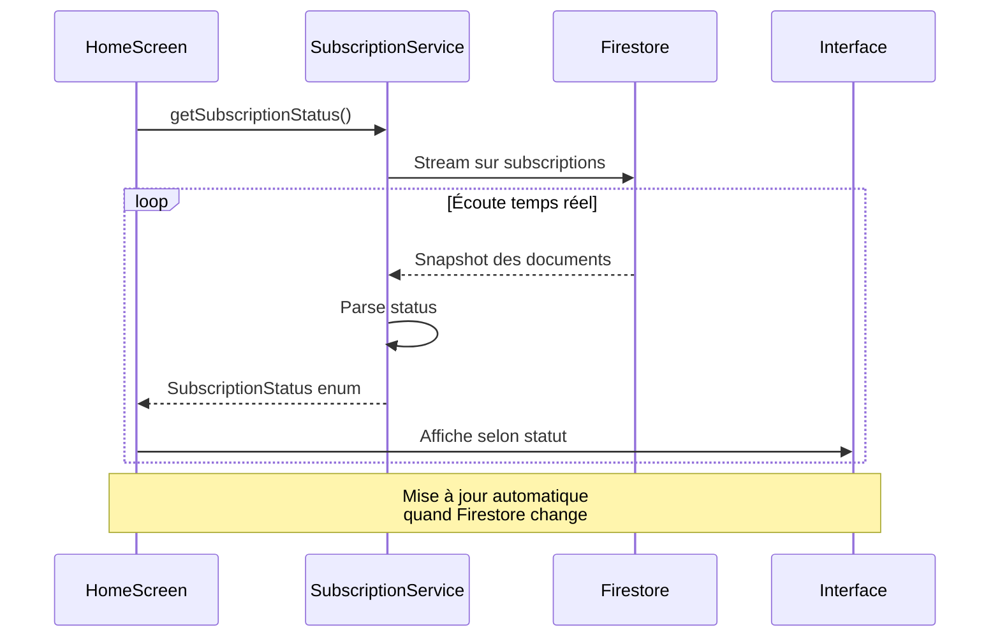
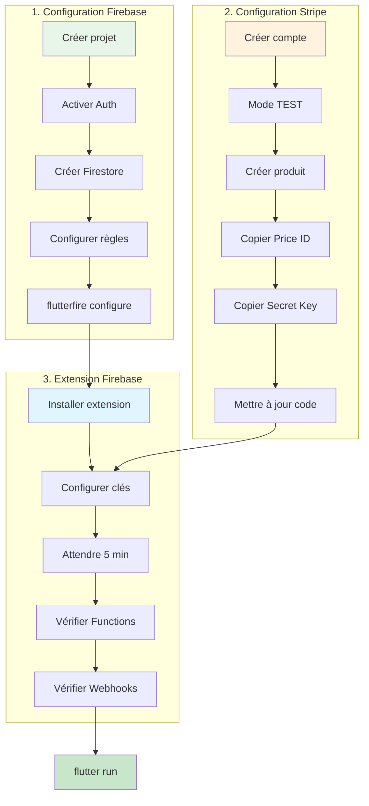

# Diagrammes Mermaid - Architecture et Flux

## Diagramme 1 : Architecture globale

## Diagramme 2 : Flux d'inscription

## Diagramme 3 : Flux de paiement complet

## Diagramme 4 : Structure Firestore

## Diagramme 5 : États d'abonnement

## Diagramme 6 : Composants Flutter

## Diagramme 7 : Vérification du statut

## Diagramme 8 : Configuration complète

## Comment lire ces diagrammes

### Diagramme 1 - Architecture
Montre la vue d'ensemble des composants et leur interaction.

### Diagramme 2 - Inscription
Séquence détaillée de création de compte.

### Diagramme 3 - Paiement
Le flux le plus important : de l'abonnement au paiement réussi.

### Diagramme 4 - Firestore
Structure des données dans la base de données.

### Diagramme 5 - États
Machine à états des abonnements Stripe.

### Diagramme 6 - Flutter
Architecture des composants Flutter de l'app.

### Diagramme 7 - Vérification
Comment l'app vérifie le statut en temps réel.

### Diagramme 8 - Configuration
Les 3 étapes de setup dans l'ordre.

