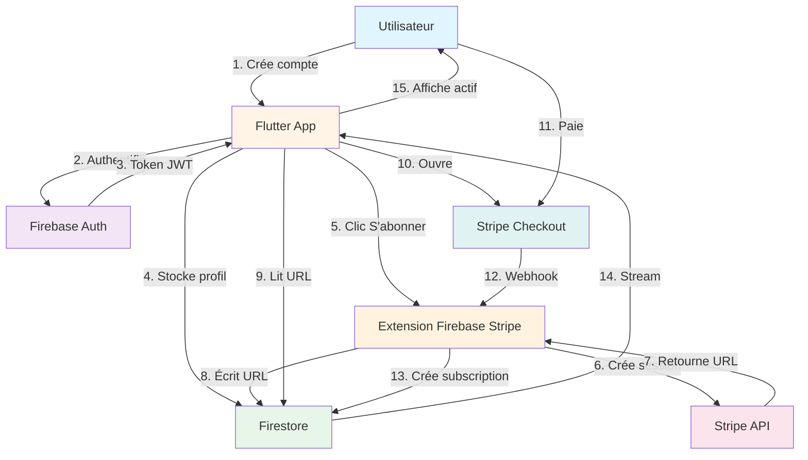
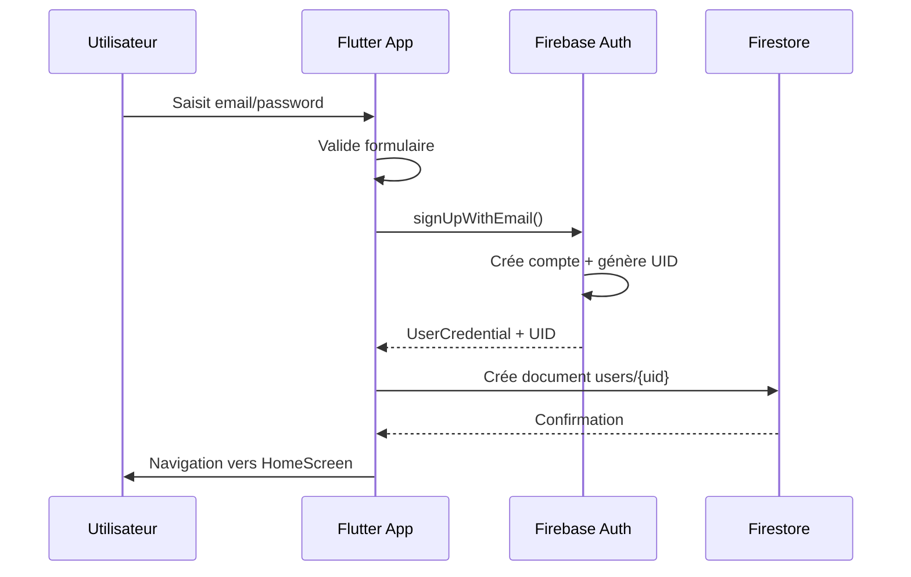
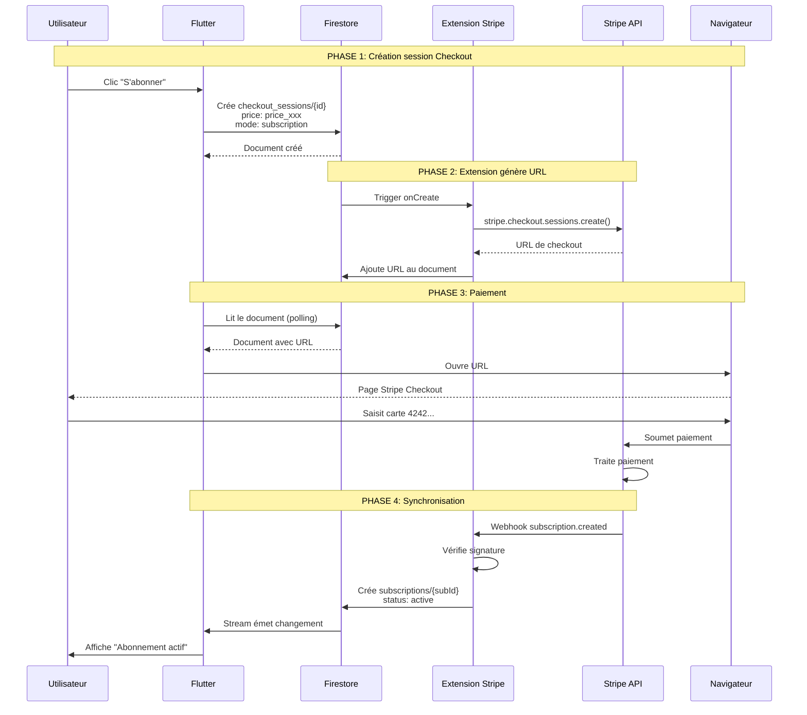
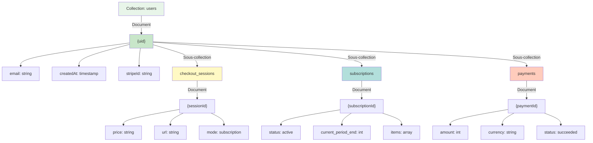
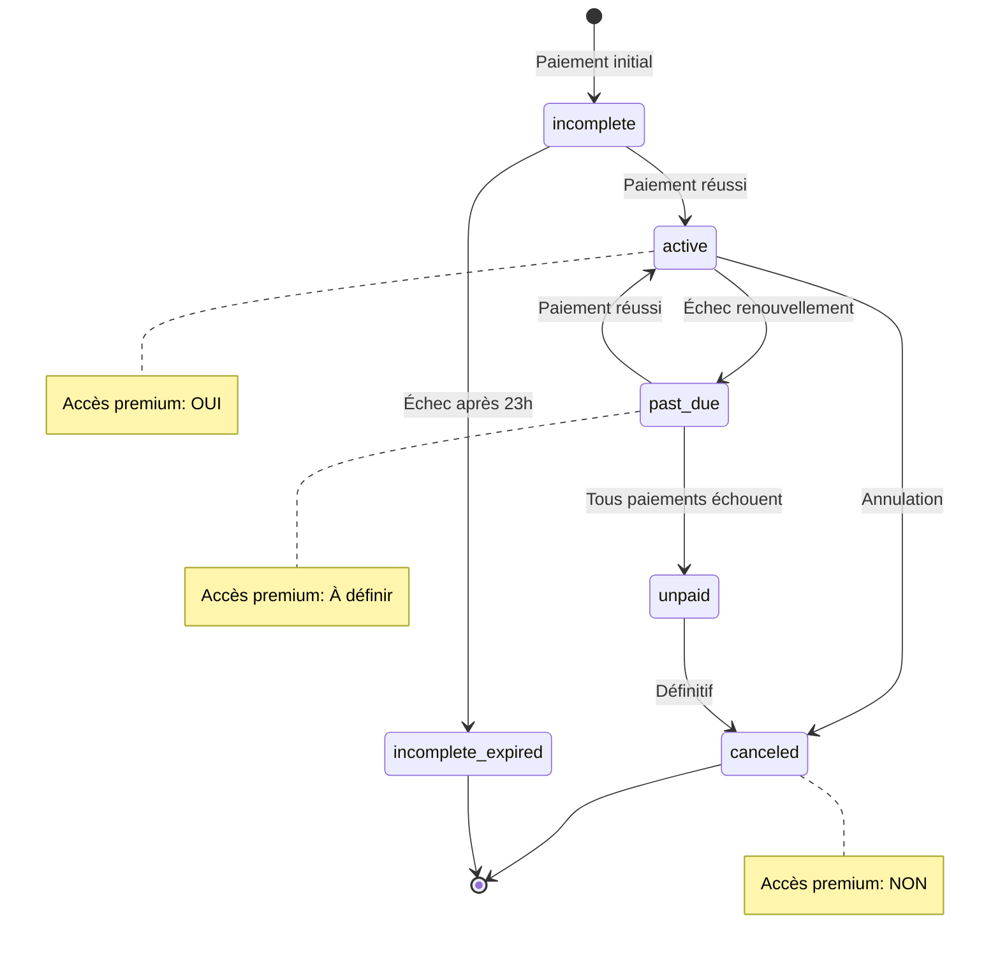
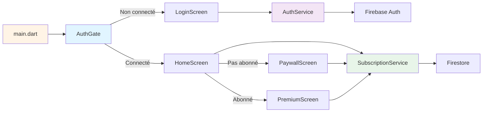
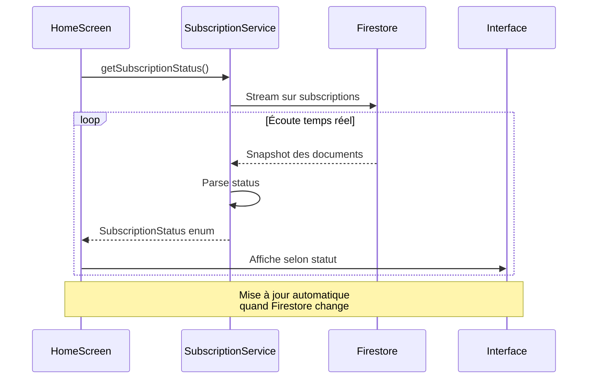
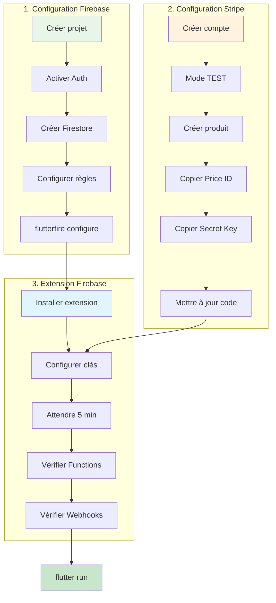

# Diagrammes Mermaid - Architecture et Flux

## Diagramme 1 : Architecture globale

### Explication

Ce diagramme montre la vue d'ensemble de l'architecture complète de l'application avec tous les composants et leurs interactions. L'utilisateur commence par créer un compte via l'application Flutter qui communique avec Firebase Auth pour l'authentification et génère un token JWT. Ensuite, le profil utilisateur est stocké dans Firestore, la base de données NoSQL en temps réel. Quand l'utilisateur clique sur "S'abonner", l'Extension Firebase Stripe entre en jeu pour créer une session de paiement via l'API Stripe. Finalement, après le paiement réussi sur Stripe Checkout, un webhook notifie l'extension qui met à jour Firestore, et Flutter affiche automatiquement le statut "Abonnement actif" grâce aux Streams en temps réel.

## Diagramme 2 : Flux d'inscription

### Explication

Ce diagramme de séquence détaille le processus complet d'inscription d'un nouvel utilisateur dans l'application. L'utilisateur saisit son email et son mot de passe dans l'interface Flutter qui valide d'abord le formulaire côté client pour assurer que les données respectent les critères minimaux. L'application appelle ensuite la méthode signUpWithEmail() qui envoie la requête à Firebase Auth pour créer le compte et générer un identifiant unique (UID). Firebase Auth retourne un UserCredential contenant l'UID et les informations de l'utilisateur que Flutter utilise pour créer un document dans la collection users de Firestore. Une fois le document créé avec succès, l'utilisateur est automatiquement redirigé vers l'écran d'accueil (HomeScreen) où il peut commencer à utiliser l'application.

## Diagramme 3 : Flux de paiement complet

### Explication

Ce diagramme illustre le flux le plus critique de l'application : le processus complet d'abonnement payant divisé en quatre phases distinctes. La Phase 1 commence quand l'utilisateur clique sur "S'abonner" et Flutter crée un document déclencheur dans Firestore avec le Price ID et le mode subscription. La Phase 2 voit l'Extension Firebase détecter automatiquement ce nouveau document et appeler l'API Stripe pour créer une session Checkout, puis stocker l'URL générée dans Firestore. La Phase 3 consiste en Flutter qui récupère cette URL par polling, l'ouvre dans le navigateur où l'utilisateur saisit sa carte bancaire (4242 4242 4242 4242 en mode test) et soumet le paiement que Stripe traite. La Phase 4 finale est la synchronisation : Stripe envoie un webhook à l'Extension Firebase qui vérifie la signature pour la sécurité, crée le document subscription dans Firestore avec le statut "active", ce qui déclenche le Stream Flutter qui met à jour instantanément l'interface utilisateur pour afficher "Abonnement actif".

## Diagramme 4 : Structure Firestore

### Explication

Ce diagramme présente l'organisation hiérarchique complète des données dans Firestore, la base de données NoSQL utilisée par l'application. La collection principale "users" contient un document par utilisateur identifié par son UID Firebase, avec les champs email, createdAt et stripeId qui est ajouté automatiquement par l'extension lors du premier paiement. Chaque document utilisateur possède trois sous-collections essentielles : checkout_sessions qui stocke les sessions de paiement avec le Price ID et l'URL Stripe, subscriptions qui contient les abonnements actifs avec leur statut et dates de période, et payments qui garde l'historique de tous les paiements avec montant, devise et statut. Cette structure hiérarchique permet d'organiser les données de manière logique et sécurisée, chaque utilisateur ayant accès uniquement à ses propres données grâce aux règles de sécurité Firestore qui utilisent l'UID pour contrôler les permissions.

## Diagramme 5 : États d'abonnement

### Explication

Ce diagramme de machine à états représente tous les statuts possibles d'un abonnement Stripe et les transitions entre ces états au cours de son cycle de vie. Un abonnement commence toujours dans l'état "incomplete" lors du paiement initial et peut soit passer à "active" si le paiement réussit, soit à "incomplete_expired" si le paiement échoue après 23 heures. Depuis l'état "active" où l'utilisateur a accès au contenu premium, l'abonnement peut devenir "past_due" en cas d'échec de renouvellement automatique ou "canceled" si l'utilisateur annule volontairement. L'état "past_due" laisse à Stripe le temps de réessayer le paiement et peut soit retourner à "active" si un paiement réussit, soit devenir "unpaid" si tous les paiements échouent définitivement. Les notes indiquent clairement que seul l'état "active" donne accès au contenu premium, l'état "past_due" nécessite une décision métier selon votre tolérance, et les états "canceled", "unpaid" et "incomplete_expired" bloquent complètement l'accès premium.

## Diagramme 6 : Composants Flutter

### Explication

Ce diagramme illustre l'architecture des composants de l'application Flutter et comment ils sont organisés et communiquent entre eux. Le point d'entrée main.dart lance l'application et affiche AuthGate qui agit comme un routeur intelligent basé sur l'état d'authentification de l'utilisateur. Si l'utilisateur n'est pas connecté, AuthGate affiche LoginScreen qui utilise AuthService pour communiquer avec Firebase Auth et gérer l'inscription ou la connexion. Une fois connecté, AuthGate redirige vers HomeScreen qui utilise SubscriptionService pour lire le statut d'abonnement depuis Firestore et afficher l'interface appropriée. Selon le statut d'abonnement, HomeScreen peut naviguer vers PaywallScreen pour proposer l'abonnement aux utilisateurs gratuits, ou vers PremiumScreen pour afficher le contenu exclusif aux utilisateurs abonnés, les deux écrans utilisant SubscriptionService pour gérer les interactions avec Stripe et Firestore.

## Diagramme 7 : Vérification du statut

### Explication

Ce diagramme de séquence montre comment l'application vérifie en temps réel le statut d'abonnement de l'utilisateur grâce aux Streams de Firestore. Quand HomeScreen se construit, il appelle immédiatement getSubscriptionStatus() sur le SubscriptionService qui établit un Stream continu sur la collection subscriptions de l'utilisateur dans Firestore. Ce Stream fonctionne en boucle permanente : dès que Firestore détecte un changement dans les données d'abonnement, il envoie automatiquement un snapshot des documents au service. Le SubscriptionService parse ensuite ces données brutes pour convertir le statut Stripe (comme "active" ou "canceled") en une énumération SubscriptionStatus que Flutter peut facilement utiliser. Enfin, HomeScreen reçoit cette énumération et met à jour l'interface utilisateur en conséquence, affichant par exemple le bouton "Accéder au Premium" pour un utilisateur abonné ou "S'abonner" pour un utilisateur gratuit, le tout sans aucune action manuelle de l'utilisateur car le Stream réagit automatiquement aux changements.

## Diagramme 8 : Configuration complète

### Explication

Ce diagramme présente la séquence complète des étapes de configuration nécessaires pour mettre en place l'application, organisée en trois groupes logiques. Le premier groupe "Configuration Firebase" commence par la création du projet Firebase, suivi de l'activation de Authentication et Firestore, puis la configuration des règles de sécurité, et se termine par l'exécution de flutterfire configure pour connecter Flutter à Firebase. Le deuxième groupe "Configuration Stripe" consiste à créer un compte Stripe, activer le mode TEST pour ne pas utiliser d'argent réel, créer le produit "Plan Premium" avec son prix mensuel, copier le Price ID et la Secret Key depuis le dashboard, et mettre à jour le code Flutter avec ces identifiants. Le troisième groupe "Extension Firebase" implique l'installation de l'extension Stripe depuis Firebase Console, la configuration avec la Secret Key Stripe, une attente obligatoire de 5 minutes pour le déploiement, la vérification que les Cloud Functions sont bien créées, et la vérification que les webhooks sont correctement configurés dans Stripe. Une fois ces trois groupes terminés dans l'ordre, vous pouvez exécuter flutter run et l'application est entièrement fonctionnelle avec tous ses composants correctement connectés.

## Comment utiliser ces diagrammes

### Pour comprendre l'architecture
Commencez par le Diagramme 1 pour avoir une vue d'ensemble, puis consultez les Diagrammes 4 et 6 pour comprendre respectivement la structure des données et l'organisation du code Flutter.

### Pour suivre le flux utilisateur
Lisez le Diagramme 2 pour l'inscription, puis le Diagramme 3 pour le processus de paiement complet qui est le coeur de l'application. Le Diagramme 7 explique comment l'application reste synchronisée en temps réel avec le statut d'abonnement.

### Pour configurer l'application
Le Diagramme 8 vous guide à travers toutes les étapes de configuration dans le bon ordre, de la création du projet Firebase jusqu'au lancement de l'application.

### Pour gérer les abonnements
Le Diagramme 5 est essentiel pour comprendre tous les états possibles d'un abonnement Stripe et comment gérer chaque situation dans votre code.

